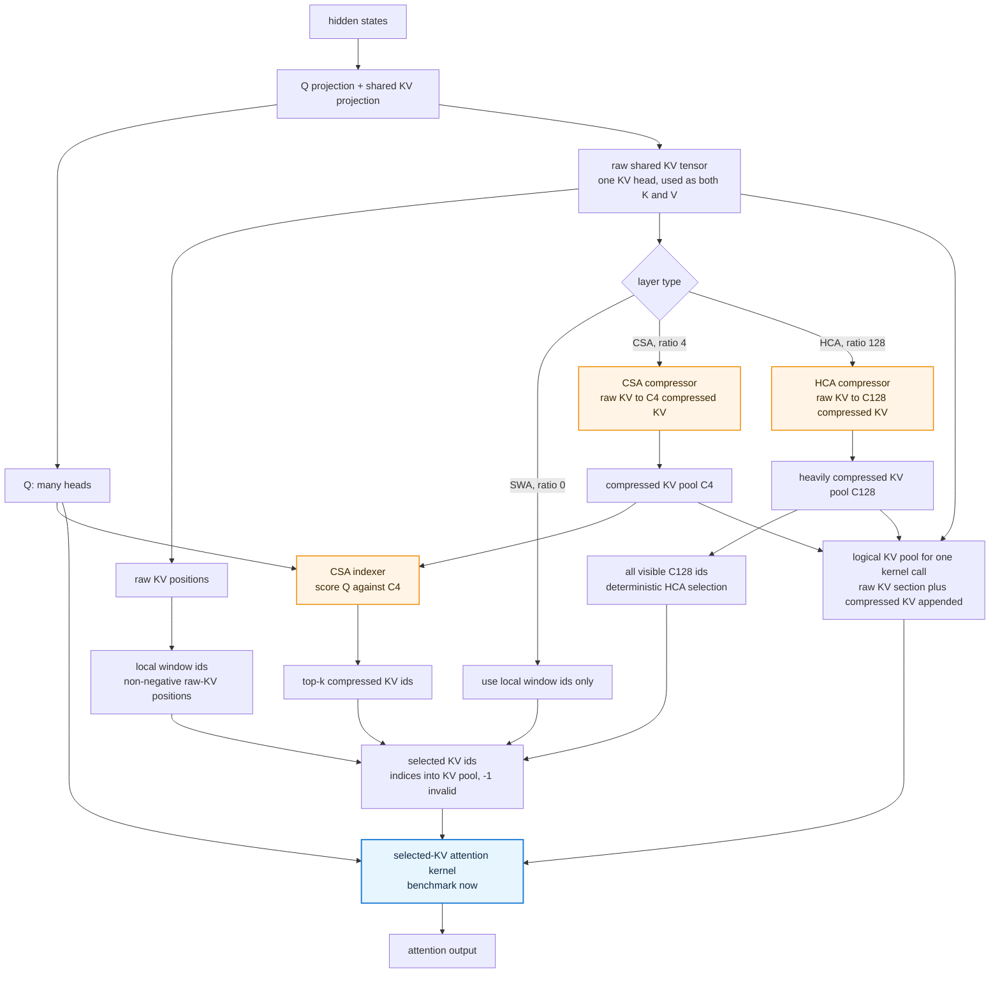

# DSv4 Hybrid Attention Surface Notes

This harness starts with one kernel boundary: selected-KV sparse attention.
Miles TileLang is the reference path for DSv4 RL bring-up; NVIDIA DSA is the
comparison path.

The v1 target is not the full CSA layer. For CSA-style shapes, it assumes the
compressor and indexer have already produced:

- compressed KV entries
- per-query top-k compressed-entry indices
- attention sink and scale metadata

## Attention Workflow



The blue node is the current benchmark target. The orange nodes are the next
backend-differentiating modules to isolate once the sparse-attention harness is
stable.

## Terms

- SWA: sliding-window attention over the recent raw KV tail.
- CSA: Compressed Sparse Attention. It has a ratio-4 compressor, an indexer,
  and sparse attention over selected compressed KV entries.
- HCA: Heavily/Highly Compressed Attention. It has a ratio-128 compressor and
  attends over all causal compressed KV entries; it does not use a learned
  top-k indexer.
- DSA: NVIDIA/Megatron sparse/indexer kernel family for DeepSeek-style sparse
  attention. It is a backend implementation boundary, not a fourth DSv4 layer
  type.
- Sparse MLA: legacy-ish naming used by Miles/TileLang for the sparse
  attention kernel surface. DSv4's main attention is better described as
  shared K=V MQA plus CSA/HCA hybrid attention, not V3-style MLA.
- Indexer top-k: the CSA selection step that decides which compressed KV
  entries each query attends to. v1 does not benchmark the indexer directly.

## Benchmark Targets

| Module | In the workflow | Why compare Miles and NVIDIA |
| --- | --- | --- |
| Selected-KV attention | The blue `selected-KV attention kernel` node | Current v1 target. It consumes `Q`, a KV pool, and selected KV ids. In CSA, those ids include learned compressed top-k; in SWA/HCA, they can be deterministic local/all-visible compressed ids. Miles uses TileLang `sparse_attn_tilelang`, while NVIDIA uses Megatron `dsa_sparse_attn` / DSA pieces. |
| CSA indexer/top-k | `CSA indexer` and `top-k compressed KV ids` | It decides which compressed KV entries each query reads. Any mismatch changes the attention result even if sparse attention itself is identical. |
| CSA/HCA compressor | `CSA compressor` and `HCA compressor` | It creates the compressed KV pools and cache state. CSA and HCA are not just different lengths: CSA uses the overlapping C4 layout, while HCA uses non-overlapping C128 windows. |
| mHC fusion | After attention output, not shown in the workflow | Important for DSv4 training, but it is a separate post-attention residual-mixing kernel. |

Standalone SWA and Q/KV/O projections are useful baselines, but they are not the
first backend-differentiating targets unless a backend fuses them into one of
the boundaries above.

## Code-Level Notes

- The shared KV projection means the model produces one tensor and reads it as
  both key and value. DSv4 uses one KV head, while Q has many heads.
- `use local window ids only` is branch logic, not a standalone kernel. For a
  ratio-0 SWA layer, no compressor or indexer runs; the selected ids are just
  the causal sliding-window raw-KV positions.
- SWA still uses Q. In NVIDIA Megatron's fused path, local SWA is represented by
  deterministic `window_idxs`; these are non-negative indices into the raw-KV
  section of `kv_full`, not negative relative offsets. `-1` only means invalid
  or padded.
- `selected KV ids` is still an index tensor, not gathered values. A naive
  implementation could gather `kv_full[selected_ids]` and run dense attention
  over that small selected set; optimized kernels normally fuse the gather,
  QK, softmax, and weighted-value steps.
- In Megatron's hybrid path, the selected-KV attention kernel sees a logical
  `kv_full`: `raw_kv` concatenated with optional compressed KV. If the raw
  section length for that call is `S_raw`, compressed positions are addressed as
  `S_raw + compressed_id`.
- `kv_full` should not be read as the required persistent serving-cache layout.
  In full-sequence training/prefill code it can be rebuilt for each forward. In
  serving, the natural cache layout is separate raw local-window state plus an
  append-only compressed pool, with indices translated into the per-call
  attention view.
- HCA does not require a learned top-k indexer. In NVIDIA Megatron's fused path,
  all visible C128 positions are generated deterministically and passed through
  the same selected-KV attention surface.
- The CSA and HCA compressors can share implementation structure, but their
  semantics differ. CSA uses ratio 4 plus overlapping Ca/Cb windows; HCA uses
  ratio 128 plus non-overlapping windows.

## Canonical Harness Surface

```python
q: [B, S, H, D] bf16
kv: [B, S_kv, D] bf16  # logical pool: raw KV plus optional compressed KV
attn_sink: [H] fp32
topk_idxs: [B, S, TopK] int32  # indices into kv; -1 means invalid
sm_scale: float | None
```

Synthetic benchmark patterns:

- `random`: random selected ids into a random KV pool; useful for pure kernel
  smoke tests.
- `swa`: raw KV only; selected ids are causal local-window raw-KV positions.
- `csa`: logical KV pool is raw KV plus C4 compressed entries; selected ids are
  local-window raw ids plus synthetic top-k C4 ids.
- `hca`: logical KV pool is raw KV plus C128 compressed entries; selected ids
  are local-window raw ids plus all causally visible C128 ids.

The output is `out: [B, S, H, D]`.

## Miles TileLang Surface

Entrypoint:

```python
from miles_plugins.models.deepseek_v4.ops.kernel.tilelang_sparse_mla import sparse_attn_tilelang
```

Expected inputs match the canonical layout:

```python
sparse_attn_tilelang(q, kv, attn_sink, topk_idxs, sm_scale) -> out
```

Backward returns gradients for `q`, `kv`, and `attn_sink`; indices and scale do
not receive gradients.

## NVIDIA DSA Surface

Entrypoint:

```python
from megatron.core.transformer.experimental_attention_variant.dsa_kernels import dsa_sparse_attn
```

The public DSA entrypoint expects SBHD/SBD tensors and internally flattens
them before calling FlashMLA:

```python
query: [S, B, H, D]
kv: [S_kv, B, D]
attn_sink: [H]
topk_idxs_flat: [S * B, TopK]
softmax_scale: float
```

For a local batch KV index `k` in row `(b, s)`, the global flat index is:

```python
global_k = k * B + b
row = s * B + b
```

Invalid `-1` entries remain `-1`.

The public output is `[S, B, H * D]`; the harness reshapes it back to
canonical `[B, S, H, D]`.

In the `radixark/miles:deepseek-v4` image, the bundled FlashMLA wheel predates
the `indexer_topk` keyword added by NVIDIA Megatron PR #4894. The harness
installs a compatibility shim for Path A/C sparse attention, where
`indexer_topk == 0`.

## First Comparison Boundary

The v1 comparison intentionally excludes:

- compressor kernel parity
- indexer/top-k kernel parity
- mHC parity
- real DSv4-Flash production shapes
- full Megatron layer integration

Kernel-level parity items become follow-up targets after the sparse attention
harness is stable. Full Megatron layer integration is deliberately out of scope
for this harness until the underlying kernels are understood.
